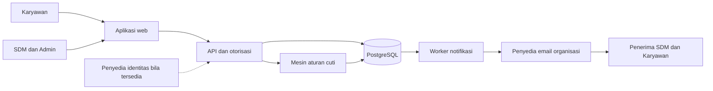
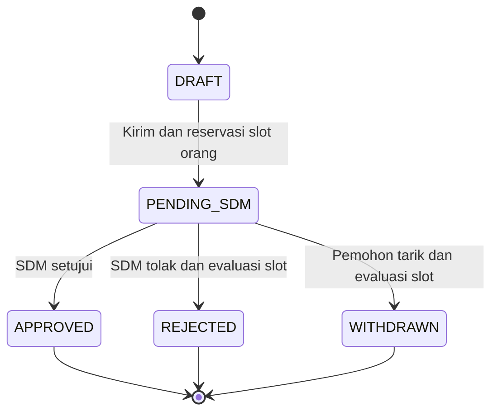

# Arsitektur — Sistem Pengajuan dan Monitoring Cuti BNI

Versi: 0.2 — kuota orang dan H-3 hari kerja  
Tanggal: 29 September 2026  
Acuan: [PRD](PRD.md) · [Desain](design.md)

## 1. Keputusan utama

Gunakan monolit modular dengan aplikasi web, API, database relasional, serta worker notifikasi. Alur inti tidak membutuhkan microservices. Pengajuan, penggunaan kuota, keputusan, audit, dan pencatatan email harus dapat disimpan secara atomik dalam satu database.

Stack implementasi awal: TypeScript, React/Vite, Express/Node.js, dan PostgreSQL embedded melalui PGlite untuk lokal. Adapter PostgreSQL eksternal tersedia. Detail menjalankan aplikasi dan status verifikasi ada pada [README](README.md).

Implementasi awal memakai snapshot JSONB dengan indeks relasional dan lock transaksi per unit. Kuota orang dihitung dari pengajuan aktif tanpa tabel membership materialized. Model normalisasi dan lock per bucket di bawah tetap merupakan rancangan target; jangan menganggap seluruh tabel tersebut sudah diimplementasikan. SMTP nyata dan PostgreSQL eksternal belum diuji di lingkungan ini.

Database menjadi sumber kebenaran untuk tanggal efektif, status, dan kuota. Pratinjau frontend tidak menjamin kapasitas; pemeriksaan akhir selalu di server dalam transaksi.

## 2. Konteks dan komponen



| Modul | Tanggung jawab |
|---|---|
| Identity & Access | Login, session, peran, lingkup unit, pemisahan tugas |
| Employee Directory | Profil, posisi, unit, kontak, status aktif |
| Policy & Calendar | Kuota orang bulanan, masa tunggu, H-3 hari kerja, batas irisan, kalender kerja |
| Leave Application | Draft, preview, submit, detail, penarikan |
| Quota & Schedule | Slot orang unik per bulan, lock kapasitas, batas orang bersamaan, pemeriksaan benturan |
| SDM Review | Konfirmasi reguler, approve/reject, alasan dan audit |
| Notifications | Penjadwalan, outbox, retry, status pengiriman |
| Reporting | Dashboard, kalender, ekspor sesuai lingkup akses |

API dan worker dapat dijalankan sebagai proses terpisah dari repository yang sama. Antrean awal memakai tabel PostgreSQL sehingga tidak membutuhkan Redis untuk MVP. Jika beban meningkat, outbox tetap dipertahankan sebagai penghubung transaksi dan antrean eksternal.

## 3. Invarian domain

1. Satuan kuota adalah **orang berbeda per posisi per bulan**. Durasi hari kerja tidak menjadi pengurang kuota.
2. Satu karyawan memakai satu slot dalam bucket unit/posisi/bulan, meskipun memiliki beberapa pengajuan aktif; berakhirnya tanggal cuti tidak melepas slot bulan itu.
3. Untuk setiap `(unit_id, position_id, month)`: `used_people = count(active employee memberships) <= limit_people`. Pada setiap tanggal, jumlah orang berbeda yang cuti bersamaan juga `<= limit_people`.
4. Setiap pengajuan terkirim memiliki 1–5 hari kerja efektif. Kuota CS BINA 2 orang tetap mengizinkan satu pengajuan 5 hari jika aturan lain terpenuhi.
5. Hari efektif tidak berada pada tiga **hari kerja** terakhir bulan berdasarkan kalender unit, bukan tiga tanggal kalender terakhir.
6. Setiap permohonan efektif hanya berada dalam satu bulan. Rentang diminta yang melewati bulan dipotong pada cutoff bulan mulai.
7. Permohonan aktif milik satu karyawan tidak boleh berbagi tanggal efektif.
8. Pengajuan posisi/unit sama dari karyawan berbeda tidak boleh memiliki rentang efektif identik dan tidak boleh beririsan lebih dari dua hari kerja per pasangan.
9. Transisi pending ke approved tidak menambah jumlah orang terpakai. Ditolak/ditarik melepas slot hanya jika tidak ada pengajuan aktif lain milik orang itu pada bucket yang sama.
10. Status terminal tidak dapat diputuskan kembali; keputusan dan event email disimpan atomik.

Kuota orang, batas orang bersamaan, dan irisan dua hari adalah pemeriksaan terpisah. Batas harian memakai nilai kuota posisi yang sama; secara matematis sudah dibatasi jumlah orang unik bulanan, tetapi tetap diperiksa untuk menjaga invarian jadwal. Cuti darurat hanya melewati pemeriksaan masa tunggu satu bulan; semua pemeriksaan lain tetap berlaku.

## 4. Model data

Gunakan UUID sebagai ID internal dan nomor permohonan yang mudah dibaca sebagai ID tampilan. Tanggal cuti disimpan sebagai `DATE`, timestamp aktivitas sebagai `TIMESTAMPTZ`. Semua operasi tanggal bisnis menggunakan Asia/Jakarta sesuai baseline; jangan menggeser DATE melalui konversi UTC browser.

| Entitas | Field penting dan fungsi |
|---|---|
| units | id, code, name, timezone, active |
| positions | id, code unik, label, active |
| users | id, identity_subject unik, active |
| employees | id, user_id unik, employee_number unik, name, unit_id, position_id, phone, email, active |
| user_roles | user_id, role, unit_id/scope; role admin tidak otomatis SDM |
| policy_versions | id, effective_from, notice_months=1, max_days=5, blocked_last_working_days=3, max_overlap_days=2, created_by |
| quota_policies | id, policy_version_id, unit_id, position_id, effective_month, limit_people; sekaligus batas orang bersamaan |
| work_calendars | id, unit_id, version, weekly_work_pattern, effective dates |
| calendar_exceptions | calendar_id, date, is_working_day, description; unik calendar/date |
| leave_requests | id, number, employee_id, unit_id_snapshot, position_id_snapshot, category, subtype, custom_subtype, reason, requested_start/end, effective_start/end, duration_days, phone_snapshot, email_snapshot, status, submitted_at, policy_version_id, calendar_version_id, confirmation_status, row_version |
| leave_days | request_id, leave_date; primary key gabungan; daftar tanggal efektif eksplisit |
| quota_buckets | id, unit_id, position_id, month, limit_people, quota_policy_id; unik unit/posisi/bulan |
| quota_memberships | id, bucket_id, employee_id, state=PENDING/APPROVED/RELEASED; unik bucket/pegawai, satu slot orang |
| quota_allocations | request_id unik, membership_id, state=PENDING/APPROVED/RELEASED; hubungan setiap pengajuan dengan slot orang, tanpa kolom debit hari |
| confirmations | id, request_id, result, confirmed_by, confirmed_at, channel, note |
| decisions | id, request_id unik, outcome, reason, actor_id, decided_at |
| request_events | id, request_id, type, actor_id, occurred_at, metadata minimum |
| sdm_recipients | unit_id, user_id, active; penerima harus memiliki kewenangan SDM |
| notification_jobs | id, event_key unik, request_id, type, scheduled_at, status, lease_until, attempts, next_attempt_at |
| notification_deliveries | id, job_id, recipient_key, destination_snapshot, status, provider_message_id, attempts, last_error; unik job/penerima |
| idempotency_records | actor_id, action, key, payload_hash, result_reference; unik actor/action/key |
| audit_logs | id, actor_id, action, resource_type/id, occurred_at, safe_metadata |

`month` pada bucket disimpan sebagai tanggal pertama bulan. `duration_days` harus sama dengan jumlah `leave_days`; service dan pemeriksaan rekonsiliasi menegakkan kesamaan ini. Alasan cuti, catatan konfirmasi, serta email/HP tidak disalin bebas ke metadata audit.

Kendala penting:

- `limit_people >= 0`; membership unik per bucket/pegawai. Jumlah membership PENDING/APPROVED tidak boleh melebihi limit; invariant agregat dijaga service dalam transaksi yang mengunci bucket, bukan CHECK lintas baris.
- Permohonan terkirim harus memiliki tanggal efektif, snapshot kebijakan, durasi 1–5, dan kontak valid; draft boleh belum lengkap.
- Validasi lintas baris seperti irisan dilakukan dengan transaksi dan lock, bukan hanya constraint sederhana.
- Indeks pengajuan pada `(unit_id_snapshot, position_id_snapshot, status, effective_start)`, `(employee_id, status)`, serta `leave_days(leave_date, request_id)`.
- Indeks job pada `(status, next_attempt_at, scheduled_at)`.
- Perubahan unit/posisi pegawai tidak memindahkan alokasi yang sudah ada. Pengajuan baru memakai penempatan baru; konflik diri sendiri diperiksa lintas penempatan.

## 5. Mesin aturan tanggal

Mesin aturan menerima actor, data karyawan, input form, waktu server, versi kalender, versi kebijakan, serta kondisi kapasitas. Hasil terstruktur berisi tanggal diminta/efektif, daftar hari efektif, durasi, penyesuaian, kode error, dan informasi ketersediaan yang aman untuk peran pengguna.

```text
evaluateDates(input, localSubmissionDate, policy, calendar):
    require requested_end >= requested_start
    minimum_start = regular
        ? addCalendarMonthClamped(localSubmissionDate, 1)
        : localSubmissionDate
    require requested_start >= minimum_start
    month_workdays = sorted(calendar.workingDatesInMonth(requested_start))
    require calendar configuration exists and month_workdays is not empty
    blocked_days = last min(policy.blocked_last_working_days, count(month_workdays)) dates
    cutoff = first(blocked_days)
    require requested_start < cutoff
    require calendar.isWorkingDay(requested_start)

    capped_end = min(requested_end, cutoff - 1 calendar day)
    effective_days = workingDatesInclusive(requested_start, capped_end)
    require 1 <= count(effective_days) <= 5
    effective_start = first(effective_days)
    effective_end = last(effective_days)
    return dates, effective_days, duration, adjustments
```

Terapkan batas input teknis panjang rentang untuk menghindari operasi tak terbatas; perhitungan utama hanya mengiterasi sampai cutoff bulan mulai. Tahun/bulan valid dan tipe data diperiksa sebelum operasi kalender.

Untuk Oktober 2026 pada kalender Senin–Jumat tanpa libur tambahan, `blocked_days` adalah 28, 29, 30 Oktober; cutoff 28 Oktober. Rentang 26–30 Oktober menjadi 26–27 Oktober (2 hari). Jika 30 Oktober diberi libur khusus pada fixture kalender, blocked_days menjadi 27, 28, 29 Oktober dan rentang itu menjadi 26 Oktober saja. Hari nonkerja tidak menghabiskan hitungan H-3. Jika bulan memiliki kurang dari tiga hari kerja, seluruh hari kerja terlarang.

`addCalendarMonthClamped(31 Jan 2027, 1)` menghasilkan 28 Feb 2027. Ini hanya batas masa tunggu; H-3 dapat menggeser pilihan valid ke bulan berikutnya. Perubahan tanggal hari ini saat melewati tengah malam membuat pratinjau harus dihitung ulang.

Saat approval, jangan menghitung ulang masa tunggu berdasarkan tanggal approval. Aturan masa tunggu divalidasi dengan `submitted_at` asli. Approval setelah hari mulai lewat diblokir berdasarkan tanggal lokal sekarang; approval pada hari mulai masih diizinkan dalam baseline.

## 6. Perhitungan kuota dan irisan

```text
active_memberships = memberships with state PENDING or APPROVED in bucket
used_people = count(active_memberships)
available_people = bucket.limit_people - used_people
already_counted = employee has active membership in bucket
additional_people = already_counted ? 0 : 1
require additional_people <= available_people

for each active own request across any position/unit:
    require intersection(new_days, own_days).size == 0

for each active other request in same unit and position:
    require new_days != other_days
    require intersection(new_days, other_days).size <= 2

for each date in new_days:
    concurrent_employees = distinct employee IDs from active leave on date
    require size(concurrent_employees union {new_request.employee_id}) <= bucket.limit_people
```

Kesamaan rentang diperiksa terhadap himpunan hari efektif; tanggal diminta berbeda yang menghasilkan tanggal efektif sama tidak dapat dipakai untuk menghindari larangan. Pemeriksaan irisan tidak menggabungkan alasan atau kontak rekan ke respons untuk karyawan.

Contoh CS BINA 2: A cuti 1 Oktober memakai satu slot; B cuti 20 Oktober memakai satu slot lagi. Sisa nol sepanjang Oktober walaupun kedua jadwal tidak beririsan. A mengambil 5 hari kerja tetap memakai satu slot. Penolakan B mengembalikan satu slot hanya jika tidak ada pengajuan aktif B lainnya pada bulan itu.

Status membership diturunkan dari seluruh allocation orang tersebut: bila ada APPROVED → APPROVED; jika tidak ada approved tetapi ada PENDING → PENDING; jika tidak ada keduanya → RELEASED. Dashboard menghitung `approved_people = count(APPROVED memberships)` dan `pending_only_people = count(PENDING memberships)`, sehingga tidak menghitung ganda orang dengan approved+pending. Jumlah pengajuan dan total durasi hari dapat dilaporkan terpisah. Mengirim, menyetujui, menolak, atau menarik pengajuan wajib menghitung ulang status membership dalam transaksi.

Tidak ada reset yang menghapus catatan pada awal bulan, dan tidak ada job yang melepas slot saat tanggal cuti selesai. Sistem menggunakan bucket baru untuk bulan cuti berikutnya, tanpa carry-over. Kebijakan kuota dapat disiapkan untuk bulan mendatang. Limit bucket yang sudah memiliki alokasi dibekukan. Pembuatan bucket dan perubahan kebijakan diserialkan melalui lock pada konfigurasi unit/posisi agar tidak terbentuk bucket dari versi yang sedang diubah.

## 7. Transaksi dan konkurensi

### 7.1 Urutan lock bersama

Semua operasi yang mengubah penempatan, jadwal, atau alokasi mengikuti urutan yang sama: record idempotensi bila ada → baris pegawai → konfigurasi unit/posisi yang relevan → bucket (urut unit/posisi/bulan bila lebih dari satu) → permohonan. Pemakaian urutan konsisten mengurangi deadlock. Retry terbatas tetap diperlukan untuk deadlock/serialization failure.

Lock pegawai membuat dua pengajuan orang yang sama tetap diperiksa berurutan meskipun unit/posisinya berbeda. Lock bucket membuat semua submit pada posisi/unit/bulan yang sama bergantian, sehingga pemeriksaan irisan dan kuota tidak membaca kondisi usang. Query konflik dilakukan ulang setelah lock diperoleh.

### 7.2 Submit

```text
BEGIN
  claim idempotency key for actor/action; verify payload hash
  lock employee; validate identity, active state, current assignment
  lock policy configuration; resolve effective versions
  create bucket if absent with unique key; lock bucket FOR UPDATE
  lock draft if applicable; verify owner, version, and DRAFT state
  recalculate date rules using actual submission date
  compare calculation fingerprint with accepted preview
  query and validate own conflicts, same-position active conflicts, and concurrent people
  find membership for employee in bucket
  require (active membership exists ? 0 : 1) <= available_people
  persist PENDING_SDM request, snapshots, and leave_days
  create/reuse membership; create PENDING allocation linked to it
  recompute membership state from all its allocations; verify bucket limit
  create request event, safe audit, and notification job
  persist idempotent result reference
COMMIT
```

Pratinjau membawa fingerprint input, versi kalender/kebijakan, tanggal lokal, dan tanggal efektif, bukan janji kuota. Kapasitas berubah yang masih mencukupi tidak perlu menggagalkan pengajuan; jika tidak cukup, respons konflik dikembalikan. Jika hasil tanggal/durasi berubah, respons meminta peninjauan ulang. Backend tidak menerima angka durasi dari klien sebagai kebenaran.

Unique key idempotensi mencegah duplikasi akibat klik ganda atau retry timeout. Key yang sama dengan payload berbeda menghasilkan konflik. Jika transaksi gagal, tidak ada pengajuan, pemakaian kuota, atau job setengah tersimpan.

### 7.3 Approval dan penolakan

- Ambil metadata permohonan untuk menentukan lock, lalu lock dalam urutan standar dan baca ulang status/versinya.
- Pastikan actor SDM berwenang dan bukan pemohon sendiri; status harus pending.
- Approval reguler mensyaratkan konfirmasi `CONFIRMED`; validasi hari mulai belum terlewati.
- Approval: ubah allocation menjadi APPROVED, hitung ulang membership menjadi APPROVED, simpan keputusan unik; jumlah slot orang tetap.
- Penolakan: tandai allocation RELEASED, hitung ulang membership dari pengajuan lain, simpan alasan wajib. Slot hanya dilepas jika membership menjadi RELEASED.
- Kedua alur menyimpan status, event, audit, dan job email keputusan dalam transaksi yang sama.
- Reservasi yang masih utuh tidak didebit ulang saat approve. Rekonsiliasi dan validasi snapshot mendeteksi inkonsistensi; jika ditemukan, blok keputusan dan kirim alert operasional.
- Dua SDM yang memutuskan bersamaan: transaksi pertama menang; kedua menerima `REQUEST_ALREADY_DECIDED` dan UI menyegarkan hasil.

### 7.4 Penarikan

Pemohon hanya dapat menarik pending. Lock dan otorisasi sama; tandai allocation RELEASED, hitung ulang membership, simpan event, serta tandai pengingat belum terkirim sebagai tidak berlaku. Slot dilepas hanya jika orang itu tidak memiliki allocation aktif lain dalam bucket. Jika approval menang lebih dulu, penarikan ditolak karena status sudah terminal.

### 7.5 Perubahan master dan kalender

Tanggal efektif dan snapshot versi tidak berubah diam-diam. Perubahan kalender menghitung ulang cutoff seluruh bulan terdampak, termasuk saat libur baru berada di luar rentang cuti tetapi menggeser H-3 ke tanggal cuti aktif. MVP memblokir perubahan yang memengaruhi permohonan aktif. Perubahan kuota hanya ke bucket periode mendatang yang belum memiliki alokasi. Alur migrasi permohonan aktif jika kalender berubah mendadak harus didesain terpisah sebelum digunakan di produksi.

## 8. Status dan konfirmasi



Konfirmasi merupakan data terpisah, bukan tambahan status approval. SDM dapat menyimpan `CONFIRMED` atau `DECLINED` beserta waktu, kanal, dan catatan. Jika `DECLINED`, permohonan tetap pending sampai ditolak/ditarik; dashboard harus memperlihatkan kebutuhan tindak lanjut. Tidak ada auto-approve atau auto-release yang belum diminta pengguna.

## 9. API yang diusulkan

Semua endpoint membutuhkan session kecuali alur autentikasi. Response menggunakan DTO yang sesuai peran. ID sulit ditebak bukan pengganti otorisasi.

| Method & path | Fungsi |
|---|---|
| GET /api/me | Profil dan peran |
| GET /api/availability?month=YYYY-MM | Tanggal tersedia dan kuota orang posisi sendiri; tanpa data pribadi rekan |
| POST /api/leave-requests/preview | Hitung tanggal, durasi, penyesuaian, kuota, konflik |
| POST /api/leave-drafts | Buat draft |
| PATCH /api/leave-drafts/:id | Ubah draft milik sendiri dengan versi |
| DELETE /api/leave-drafts/:id | Hapus draft milik sendiri |
| POST /api/leave-requests | Submit baru atau dari draft; Idempotency-Key wajib |
| GET /api/leave-requests | Daftar sendiri; perlu pagination/filter tervalidasi |
| GET /api/leave-requests/:id | Detail sendiri atau SDM berwenang |
| POST /api/leave-requests/:id/withdraw | Tarik pending; version dan idempotensi |
| GET /api/sdm/leave-requests | Antrean pada unit yang diizinkan |
| POST /api/sdm/leave-requests/:id/confirmation | Catat konfirmasi reguler |
| POST /api/sdm/leave-requests/:id/decision | Approve/reject, reason, expectedVersion, Idempotency-Key |
| GET /api/sdm/dashboard | Kuota dan metrik pada lingkup unit |
| GET /api/sdm/calendar | Kalender terfilter |
| POST /api/sdm/exports | Ekspor sesuai akses dan filter, tercatat di audit |
| /api/admin/employees, positions, policies, calendars | Operasi master; validasi periode dan akses admin |
| GET /api/admin/notifications | Status dan kegagalan pengiriman |
| POST /api/admin/notifications/:id/retry | Retry terkendali, tanpa keputusan/email baru yang berbeda |

Contoh respons preview untuk Teller yang belum memakai slot, dengan sisa kuota 4 orang dan masa tunggu yang telah terpenuhi:

```json
{
  "requested": { "start": "2026-10-26", "end": "2026-10-30" },
  "effective": { "start": "2026-10-26", "end": "2026-10-27" },
  "days": ["2026-10-26", "2026-10-27"],
  "durationDays": 2,
  "adjustments": [{ "code": "MONTH_END_TRUNCATION", "removedWorkingDays": 3 }],
  "quota": { "limitPeople": 4, "pendingOnlyPeople": 0, "approvedPeople": 0, "availablePeople": 4, "additionalPeople": 1, "alreadyCounted": false },
  "errors": [],
  "canSubmit": true,
  "previewFingerprint": "opaque-server-value"
}
```

Gunakan 401 untuk sesi tidak valid, 403/404 sesuai strategi penyamaran objek untuk akses tidak sah, 422 untuk input/kebijakan tidak valid, dan 409 untuk konflik versi, kapasitas berubah, atau status telah diputuskan. Sertakan kode stabil seperti `NOTICE_PERIOD`, `MONTH_END_BLOCKED`, `DURATION_LIMIT`, `QUOTA_EXCEEDED`, `CONCURRENT_PEOPLE_LIMIT`, `OVERLAP_LIMIT`, `IDENTICAL_RANGE`, `PREVIEW_CHANGED`, `STALE_VERSION`. Kode error diterjemahkan ke teks UI; jangan mengirim stack trace.

## 10. Penjadwalan dan pengiriman email

### 10.1 Jadwal

```text
regular_due_date = subtractCalendarMonthClamped(effective_start, 1)
regular_due_at = atLocalTime(regular_due_date, 08:00, Asia/Jakarta)
scheduled_at = max(submitted_at, regular_due_at)

emergency scheduled_at = submitted_at
decision scheduled_at = decided_at
```

Kurangi bulan menggunakan semantik clamp yang sama; jangan mengganti bulan dengan 30 × 24 jam. Job dibuat saat transaksi bisnis tersimpan. Pengingat reguler memeriksa kembali status pending dan konfirmasi sebelum kirim. Jika approved/rejected/withdrawn atau sudah dikonfirmasi, job menjadi `SKIPPED` dengan alasan.

Penerima SDM di-resolve dari konfigurasi aktif unit saat job jatuh tempo, lalu delivery per penerima disimpan. Email keputusan memakai snapshot alamat pada permohonan. Tidak ada penerima SDM menghasilkan status gagal konfigurasi dan alert admin, bukan hilangnya job.

### 10.2 Worker dan keandalan

1. Scheduler mengambil job jatuh tempo menggunakan `FOR UPDATE SKIP LOCKED` dan lease singkat.
2. Worker memeriksa relevansi event/status, membuat delivery unik per penerima, lalu mengirim di luar transaksi database yang panjang.
3. Simpan hasil provider dan message ID; satu penerima gagal tidak mengirim ulang ke penerima yang sudah sukses.
4. Gunakan retry backoff, misalnya 1, 5, 15, 60 menit, lalu 6 jam. Setelah batas upaya, tandai gagal akhir dan alert operator.
5. Lease kedaluwarsa dapat diambil worker lain setelah proses mati. Event key dan delivery key mencegah duplikasi internal.
6. Jika provider mendukung idempotency key, gunakan delivery ID. Tanpa dukungan provider, kegagalan setelah provider menerima namun sebelum DB mencatat dapat menghasilkan email ganda; jangan menjanjikan exactly-once.

Ada kemungkinan email pengingat sudah dalam proses kirim tepat saat SDM mengambil keputusan. Pemeriksaan status sebelum kirim mengurangi race tetapi tidak dapat menarik email yang sudah diterima provider. Tautan selalu menampilkan status terkini.

Email menggunakan template ringkas: nomor pengajuan, status/identitas minimum yang dibutuhkan, tanggal efektif, serta tautan login. Alasan sakit, duka, dan penolakan lengkap dibaca dalam aplikasi. Escape semua field pengguna pada HTML email dan UI.

## 11. Keamanan dan data pribadi

- Terapkan RBAC ditambah pembatasan unit dan kepemilikan objek di server; uji akses langsung ke ID dan ekspor.
- Pilihan autentikasi diputuskan bersama organisasi; gunakan identitas perusahaan jika tersedia. Session cookie memakai HttpOnly, Secure, dan kebijakan SameSite yang sesuai alur login; lindungi mutasi dari CSRF.
- Cegah SDM menyetujui dirinya sendiri. Administrator tidak memperoleh akses alasan medis atau kewenangan approval hanya karena memiliki akses konfigurasi.
- Batasi perubahan email snapshot ke domain yang diizinkan organisasi; tetap bisa diedit sesuai kebutuhan pengguna. Detail sensitif tidak dikirim dalam email.
- Enkripsi transport, backup, dan media penyimpanan; kelola kredensial database/email di secret manager lingkungan deployment.
- Jangan mencatat alasan, isi form, token autentikasi, atau kontak lengkap dalam log aplikasi. Audit menyimpan actor, aksi, objek, waktu, dan perubahan status yang diperlukan.
- Ekspor mengecualikan alasan secara default, memfilter lingkup unit, mencegah formula injection pada CSV, serta tidak menggunakan tautan publik.
- Retensi alasan cuti, audit, backup, lokasi data, akses operator, dan penghapusan pegawai membutuhkan keputusan organisasi sebelum produksi.

Rancangan ini tidak menyatakan kepatuhan terhadap standar/regulasi tertentu; penilaian kebijakan keamanan organisasi dilakukan sebelum deployment.

## 12. Operasi dan deployment

Lingkungan development, staging, dan production terpisah. Staging menggunakan data sintetis dan email sandbox. Deployment menjalankan migrasi terkontrol sebelum API/worker versi baru, dengan kompatibilitas skema saat rollout. Jangan seed akun SDM atau kredensial bawaan di production.

Metrik awal:

- Latensi dan error preview/submit/decision.
- Waktu tunggu lock, konflik kuota, serta kegagalan transaksi.
- Usia job email tertua, retry, gagal akhir, dan unit tanpa penerima SDM.
- Pending yang tanggal mulainya sudah terlewati.
- Selisih rekonsiliasi pengajuan aktif, allocation, membership orang, dan kapasitas bucket; ketidakcocokan duration_days dengan leave_days diperiksa terpisah.

Rekonsiliasi membangun ulang himpunan orang unik per unit/posisi/bulan dari pengajuan aktif, membandingkannya dengan membership/alokasi, dan memeriksa limit bucket. Status pending-only/approved harus sesuai pengajuan orang tersebut; durasi diperiksa terpisah dari kuota. Selisih menghasilkan alert; perbaikan slot tidak dilakukan diam-diam. Backup database terenkripsi dan uji restore diperlukan sebelum pilot produksi. RPO/RTO, volume pengguna, dan SLA ditetapkan bersama pemilik layanan.

## 13. Strategi pengujian implementasi

| Lapisan | Kasus utama |
|---|---|
| Unit aturan tanggal | Semua panjang bulan, tahun kabisat, clamp satu bulan, tiga hari kerja terakhir, libur menggeser cutoff, kurang dari tiga hari kerja, rentang lintas bulan, durasi 0/5/>5 |
| Unit kuota | Orang unik, durasi 5 hari tetap satu slot, beberapa permohonan orang sama, approved+pending tidak ganda, penolakan sebagian tidak melepas slot, tanggal cuti selesai tidak melepas slot, bulan baru, tanpa carry-over |
| Unit irisan | 0/1/2/3 hari, identik 1–2 hari, konflik diri sendiri, beda posisi; tes terisolasi dari kuota |
| Integrasi transaksi | Dua orang baru berebut satu slot tersisa, pengajuan ulang orang yang sudah terhitung saat kuota penuh, double submit key sama, approve-versus-reject, approve-versus-withdraw, rollback saat menulis job |
| Integrasi kapasitas harian | Jumlah orang bersamaan dibatasi limit posisi yang sama dengan kuota bulanan, irisan 2 hari tidak membebaskan batas orang |
| Integrasi notifikasi | Jadwal reguler, kirim segera jika due lewat, darurat, skip job setelah konfirmasi/keputusan, retry parsial penerima, lease recovery |
| Otorisasi | Kepemilikan, batas unit, admin tanpa hak review, larangan self-approval, ekspor dan kebocoran metadata |
| End-to-end | Form → preview pemotongan → submit → konfirmasi SDM → keputusan → email sandbox → dashboard kuota |
| Operasional | Migrasi, backup/restore, rekonsiliasi, alarm job gagal |

Gunakan clock yang dapat dikendalikan untuk tes jadwal dan tengah malam. AC06 dapat diuji dengan kuota Teller asli 4 orang: A 5 hari dan B 3 hari dengan irisan 2 hari hanya memakai 2 slot. Seluruh AC pada PRD harus dipetakan ke test case/UAT sebelum rilis. Uji darurat memastikan hanya masa tunggu yang dikecualikan, sedangkan H-3, kuota, kapasitas harian, irisan, dan batas durasi tetap diterapkan.

## 14. Urutan implementasi

1. Finalisasi asumsi operasional dan seed posisi/kuota orang per bulan: CS BINA 2, Teller 4, CS FTE 2, BBO 2, BM 2, BTRM 3, lainnya 2.
2. Buat skema, otorisasi, kalender, dan mesin aturan dengan tes deterministik.
3. Buat submit transaksional, membership dan alokasi slot orang, audit, dan idempotensi.
4. Buat form/riwayat serta antrean/kalender SDM.
5. Buat konfirmasi, keputusan, worker email, dan monitoring kegagalan.
6. Uji konkurensi, akses, skenario kalender nyata, dan UAT SDM sebelum pilot.

Keputusan yang belum ditutup mengikuti daftar asumsi PRD: cakupan unit, label Cleaning Staff, dan alur konfirmasi/email. H-3 tiga hari kerja, darurat hanya bebas masa tunggu, nama BTRM, kuota orang per bulan, dan batas orang bersamaan sesuai kuota sudah dikonfirmasi. Implementasi harus mengikuti keputusan tersebut.
