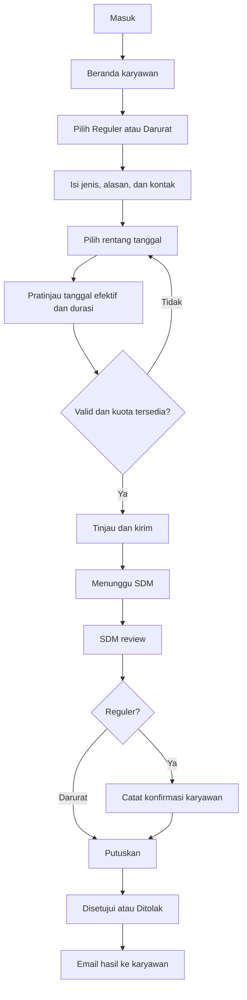

# Desain Produk — Sistem Cuti BNI

Versi: 0.2 — kuota orang dan H-3 hari kerja  
Tanggal: 29 September 2026  
Acuan: [PRD](PRD.md) · [Arsitektur](architecture.md)

## 1. Prinsip desain

Form harus menjawab tiga pertanyaan sebelum karyawan menekan Kirim: kapan cuti boleh dimulai, berapa hari kerja yang benar-benar diajukan, dan apakah permohonan masih sesuai kuota serta jadwal posisi. Jika tanggal dipotong oleh aturan akhir bulan, perubahannya harus terlihat jelas dalam ringkasan.

Bahasa antarmuka menggunakan istilah yang familiar: “Ajukan cuti”, “Menunggu SDM”, “Hari kerja”, dan “Tanggal efektif”. Istilah teknis seperti reservasi, job, outbox, dan idempotensi tidak ditampilkan kepada karyawan.

Kuota orang per bulan, durasi hari kerja per permohonan, dan jumlah orang yang cuti pada satu tanggal adalah metrik berbeda. Kuota bulanan menghitung karyawan berbeda, termasuk yang tanggal cutinya sudah selesai pada bulan itu. Batas orang bersamaan menggunakan angka kuota posisi yang sama.

## 2. Struktur navigasi

| Pengguna | Navigasi |
|---|---|
| Karyawan | Beranda · Ajukan Cuti · Pengajuan Saya · Profil |
| SDM | Ringkasan · Pengajuan · Kalender Cuti · Laporan |
| Administrator | Karyawan · Posisi & Kuota · Kalender Kerja · Pengguna & Akses · Notifikasi · Audit |

Pengguna dengan beberapa peran dapat mengganti area kerja. Sidebar hanya menampilkan modul yang diizinkan, namun server tetap memeriksa akses setiap permintaan. Pada ponsel, sidebar berubah menjadi menu; tombol utama tetap mudah dijangkau tanpa menutup isi form.

## 3. Alur utama



Notifikasi reguler mengikuti jadwal satu bulan sebelum tanggal mulai efektif. Pengajuan sudah terlihat pada antrean SDM sejak dikirim. Notifikasi darurat langsung diantrekan. Email berisi tautan menuju aplikasi yang membutuhkan login.

## 4. Beranda karyawan

Urutan konten:

1. Sapaan, posisi, dan unit dari profil aktif.
2. Tombol “Ajukan cuti”.
3. Ringkasan kuota bulan dipilih dalam **orang per posisi per bulan**, sesuai konfirmasi pengguna pada PRD.
4. Pengajuan aktif dan status terbaru.
5. Ringkasan aturan: masa tunggu reguler, maksimal 5 hari kerja per pengajuan, serta periode akhir bulan yang tidak tersedia.

Ringkasan kuota menampilkan “Kuota posisi”, “Disetujui”, “Menunggu SDM”, dan “Tersedia”, semuanya dalam orang. Satu orang yang punya approved sekaligus pending hanya masuk Disetujui; Menunggu SDM menghitung orang yang hanya memiliki pending. Jumlah hari kerja tampil terpisah pada detail pengajuan.

Contoh kartu CS BINA: kuota 2 orang. A cuti 1 Oktober membuat sisa 1; B cuti 20 Oktober membuat sisa 0 walaupun tanggal tidak bersamaan. Teks pendamping: “Maksimal 2 karyawan CS BINA dapat mengambil cuti pada bulan ini.” Satu pengajuan 5 hari kerja tetap memakai satu slot orang. Jika pengguna sudah memakai slot pada bulan itu, tampilkan “Anda sudah termasuk dalam kuota terpakai”; jangan memblokir pengajuan tambahan hanya karena sisa orang baru nol, tetapi tetap validasi tanggal dan aturan lainnya.

Kalender ketersediaan rekan hanya memperlihatkan tanggal dan informasi konflik yang diperlukan. Karyawan tidak dapat melihat alasan, jenis darurat, email, atau nomor HP rekan.

## 5. Form pengajuan

### 5.1 Tata letak

Desktop menggunakan form utama dan ringkasan perhitungan di kanan. Pada ponsel, ringkasan tampil setelah pemilih tanggal dan sebelum tombol kirim. Hindari ringkasan mengambang yang menutupi field.

```text
Ajukan cuti
Posisi: Teller                    Unit: [dari profil]

[ Reguler ] [ Darurat ]
Petunjuk sesuai kategori

Jenis cuti       [................................]
Alasan           [................................]
                 [................................]

Mulai diminta    [pilih tanggal]
Akhir diminta    [pilih tanggal]

Ringkasan tanggal
Tanggal diminta  : ...
Tanggal efektif : ...
Durasi          : ... hari kerja
Penyesuaian     : ...
Kuota tersedia  : ... orang

Nomor HP        [nilai dari profil, dapat diedit]
Email           [nilai dari profil, dapat diedit]

[Simpan draft]                         [Tinjau pengajuan]
```

### 5.2 Perbedaan kategori

| Bagian | Reguler | Darurat |
|---|---|---|
| Penjelasan | “Tanggal mulai paling awal satu bulan setelah Anda mengirim pengajuan.” | “Cuti darurat dapat diajukan mulai hari ini.” |
| Jenis | Input jenis wajib; dapat diganti master setelah SDM menyepakati daftar | Duka, Sakit, Lainnya |
| Field tambahan | Tidak ada | Nama jenis wajib jika memilih Lainnya |
| Minimum tanggal | Hasil tambah satu bulan kalender | Hari ini |
| Notifikasi SDM | Tampilkan tanggal pengingat yang dihitung | “SDM akan diberi tahu setelah pengajuan terkirim.” |
| Aturan lain | Berlaku menurut PRD | Hanya bebas masa tunggu; H-3 hari kerja, kuota orang, batas orang bersamaan, irisan, durasi, dan approval tetap berlaku |

Saat kategori diubah, jenis dan tanggal dievaluasi ulang. Alasan serta kontak dipertahankan. Tanggal yang tidak lagi valid diberi pesan, tidak diganti diam-diam.

### 5.3 Perilaku kalender dan durasi

- Tanggal mulai nonkerja, sebelum batas masa tunggu, dan tiga hari kerja terakhir bulan tidak dapat dipilih; penjelasannya tersedia melalui fokus keyboard maupun klik bantuan. H-3 dihitung dari kalender unit, dengan hari libur dikeluarkan dari hitungan.
- Pemilih tanggal akhir menerima tanggal yang masuk H-3 agar sistem dapat menunjukkan pemotongan yang diminta pengguna. Awal harus tetap valid.
- Jika akhir jatuh pada akhir pekan/libur, tanggal akhir efektif menjadi hari kerja terakhir dalam rentang sebelum cutoff.
- Jika rentang melewati bulan, ringkasan berhenti sebelum H-3 bulan mulai dan menjelaskan bahwa bulan berikutnya membutuhkan pengajuan terpisah.
- Durasi dihitung inklusif dari daftar hari kerja efektif, bukan selisih tanggal biasa.
- Frontend menampilkan pratinjau dari server, beserta loading dan waktu pembaruan. Balasan pratinjau lama tidak boleh menimpa pilihan tanggal yang lebih baru.
- Bila pratinjau belum tersedia atau tidak valid, “Tinjau pengajuan” dinonaktifkan dengan penjelasan yang dapat dibaca pembaca layar.

Contoh pesan pemotongan:

> Tanggal akhir disesuaikan dari 30 Oktober menjadi 27 Oktober 2026 karena 28–30 Oktober adalah tiga hari kerja terakhir bulan. Pengajuan Anda menjadi 26–27 Oktober, sebanyak 2 hari kerja.

Contoh tersebut hanya menjelaskan pemotongan tanggal; pengajuan tetap harus memenuhi kuota, masa tunggu, dan konflik.

Contoh penjelasan batas tanggal yang bertabrakan:

> Masa tunggu satu bulan berakhir pada 29 Oktober. Tanggal 28–30 Oktober tidak tersedia karena aturan tiga hari kerja terakhir, sedangkan 31 Oktober–1 November adalah akhir pekan. Tanggal kerja berikutnya yang tersedia adalah 2 November 2026.

Tanggal saran memperhitungkan kalender unit yang sebenarnya; 2 November hanya benar untuk kalender contoh di PRD.

### 5.4 Tinjau sebelum kirim

Ringkasan menampilkan kategori, jenis, alasan, kontak tujuan, tanggal diminta, tanggal efektif, durasi, pemakaian kuota, serta jadwal pemberitahuan SDM. Jika terjadi pemotongan, pengguna harus mencentang “Saya memahami tanggal dan durasi yang disesuaikan” sebelum mengirim.

Status ditampilkan sebagai “Draft” sebelum submit, lalu “Menunggu SDM” sesudah sukses. Tidak ada pilihan status yang dapat diubah karyawan.

Tombol kirim menampilkan proses dan mencegah klik berulang. Jika koneksi putus setelah pengiriman, UI memeriksa hasil menggunakan identitas percobaan yang sama sebelum mencoba ulang. Jangan menyimpulkan bahwa pengajuan gagal hanya karena halaman timeout.

Sesudah sukses, tampilkan nomor pengajuan, durasi efektif, status, serta tombol “Lihat pengajuan”. Keberhasilan pengajuan terpisah dari keberhasilan email.

### 5.5 Pesan validasi

| Keadaan | Contoh teks |
|---|---|
| Kurang masa tunggu | “Untuk cuti reguler, pilih tanggal mulai pada atau setelah {tanggal}.” |
| Awal H-3 | “Tiga hari kerja terakhir bulan tidak dapat menjadi tanggal cuti.” |
| Durasi > 5 | “Maksimal 5 hari kerja per pengajuan. Rentang ini berisi {n} hari kerja.” |
| Kuota penuh untuk orang baru | “Kuota {posisi} bulan {bulan} sudah terpakai oleh {limit} karyawan. Pilih bulan lain yang masih tersedia.” |
| Orang bersamaan melebihi batas | “Maksimal {limit} karyawan pada posisi ini dapat cuti bersamaan. Pilih tanggal lain yang memenuhi kuota bulanan dan aturan irisan.” |
| Irisan > 2 | “Jadwal ini beririsan {n} hari kerja dengan pengajuan lain pada posisi Anda. Maksimal irisan adalah 2 hari.” |
| Rentang persis sama | “Rentang cuti ini sudah diajukan karyawan lain pada posisi yang sama. Pilih rentang berbeda.” |
| Konflik milik sendiri | “Tanggal ini bertabrakan dengan pengajuan Anda yang masih aktif.” |
| Pratinjau berubah | “Ketersediaan atau perhitungan tanggal berubah. Tinjau ringkasan terbaru sebelum mengirim kembali.” |
| Email salah | “Masukkan alamat email yang valid.” |
| Tidak ada hari efektif | “Tidak ada hari kerja yang dapat diajukan dalam rentang ini.” |

Pesan konflik untuk karyawan tidak menyebut identitas atau alasan cuti rekan. SDM dapat membuka rincian konflik sesuai kewenangan unitnya.

## 6. Pengajuan saya dan detail

Daftar dapat difilter menurut bulan cuti, kategori, dan status. Setiap baris/kartu menampilkan nomor, tanggal efektif, hari kerja, kategori, serta status. Tanggal submit tetap tersedia sebagai informasi terpisah.

Detail memuat:

- Ringkasan status dan penjelasan langkah selanjutnya.
- Tanggal diminta dibandingkan tanggal efektif, termasuk alasan pemotongan.
- Kontak snapshot dan data jenis/alasan milik pengguna.
- Timeline pengiriman, konfirmasi, dan keputusan, dengan nama pemeriksa yang relevan.
- Alasan penolakan yang terlihat hanya bagi pemohon serta SDM berwenang.
- Tombol “Tarik pengajuan” hanya saat pending. Jelaskan bahwa slot orang kembali tersedia hanya jika tidak ada pengajuan pending/approved lain milik pengguna pada bulan dan posisi yang sama.

Pengajuan ditolak/ditarik dapat disalin ke draft baru. Pengajuan approved tidak memiliki tombol ubah atau batal dalam MVP; penanganan perubahan sesudah approval harus disepakati sebelum fitur itu ditambahkan.

## 7. Ruang kerja SDM

### 7.1 Ringkasan dan antrean

Filter utama: unit, bulan cuti, posisi, kategori, status. Ringkasan menampilkan orang disetujui, orang yang hanya menunggu SDM, sisa orang, jumlah pengajuan darurat, dan jumlah pending yang tanggal mulainya terlewati. Durasi hari merupakan metrik terpisah. Orang approved+pending dihitung sekali pada Disetujui; jumlah pengajuan pending dapat lebih besar daripada jumlah orang pending.

Antrean default mengutamakan darurat dan tanggal mulai terdekat, dengan waktu masuk sebagai pemecah urutan. Tabel memuat karyawan, posisi, kategori, tanggal efektif, durasi hari kerja, tanggal masuk, konfirmasi, dan status.

Notifikasi email yang belum waktunya tidak menyembunyikan permohonan dari antrean. Tidak ada bulk approve di MVP karena SDM perlu memeriksa setiap permohonan dan konfirmasinya.

### 7.2 Detail review

Desktop memakai panel data pengajuan dan panel evaluasi. Ponsel menampilkan keduanya berurutan.

Panel evaluasi memuat:

1. Hasil pemeriksaan masa tunggu pada saat submit dan aturan tanggal.
2. Durasi hari kerja dan pemakaian slot orang; perhitungan tidak menggandakan karyawan yang sudah memakai slot pada bulan/posisi yang sama.
3. Daftar irisan yang diizinkan atau konflik, dengan tanggal kerja yang bersinggungan.
4. Kalender/kebijakan yang dipakai saat pengajuan.
5. Konfirmasi reguler: belum dikonfirmasi, jadi mengambil, atau tidak jadi; waktu/kanal/catatan.
6. Tombol “Setujui” dan “Tolak”.

“Setujui” reguler tidak aktif sebelum konfirmasi “jadi mengambil” tercatat. Penolakan membuka dialog dengan alasan wajib. Kedua keputusan memiliki ringkasan sebelum eksekusi. Bila pemeriksa lain sudah memutuskan, layar menyegarkan status dan tidak mengirim keputusan kedua.

### 7.3 Kalender SDM

Tampilan bulanan dan daftar mingguan. Tanggal H-3 diberi arsiran dan label, hari libur memakai ikon kalender, pending memakai garis putus-putus plus teks, approved memakai garis solid plus teks. Status tidak bergantung pada warna.

Setiap chip menampilkan nama, posisi, dan status; alasan darurat tidak tampil di kalender. Klik membuka detail. Filter posisi membantu SDM memahami irisan dua hari yang masih diperbolehkan. Tampilkan jumlah orang pada tiap tanggal beserta batasnya, misalnya “CS BINA: 2/2 orang”; kalender juga menampilkan pemakaian orang selama satu bulan agar hari kosong tidak disalahartikan sebagai kuota bulanan tersedia. Kalender tidak menawarkan drag-and-drop tanggal karena permohonan terkirim tidak dapat diedit.

## 8. Administrasi

Master posisi menggunakan kode stabil; nama **BTRM** sudah dikonfirmasi, label Cleaning Staff masih perlu dicocokkan dengan master pegawai. Kuota menampilkan satuan **orang/posisi/bulan** dan tanggal mulai berlakunya. Batas orang bersamaan mengikuti angka kuota tersebut, tanpa field kapasitas terpisah. Form kebijakan menunjukkan dampak terhadap periode mendatang dan tidak menulis ulang pemakaian historis.

Kalender kerja menetapkan pola hari kerja dan tanggal libur/kerja khusus. Perubahan kalender mengevaluasi ulang tiga hari kerja terakhir untuk seluruh bulan terdampak, termasuk jika tanggal libur yang diubah berada di luar rentang pengajuan. Jika hasilnya memengaruhi pengajuan aktif, tampilkan daftar terdampak dan blok perubahan sampai konflik administrasi diselesaikan; jangan mengubah tanggal pengajuan terkirim secara diam-diam.

Konfigurasi notifikasi memuat penerima SDM per unit dan halaman kesehatan pengiriman. Ketika suatu unit belum memiliki penerima SDM, beri peringatan admin sebelum unit diaktifkan. Masalah setelah unit aktif dicatat sebagai gangguan pengiriman tanpa menghilangkan pengajuan dari dashboard.

## 9. Identitas visual dan aksesibilitas

Rancangan visual awal memakai latar abu-abu terang, kartu putih, aksen teal, dan oranye pada tindakan utama. Warna ini merupakan arah desain sementara; logo dan panduan merek resmi harus disediakan/disetujui sebelum produksi.

| Token awal | Nilai | Pemakaian |
|---|---|---|
| Background | `#F4F7F8` | Latar halaman |
| Surface | `#FFFFFF` | Form dan kartu |
| Text | `#172B35` | Teks utama |
| Muted | `#52636D` | Keterangan |
| Primary | `#006776` | Navigasi aktif/tombol dengan teks putih |
| Accent | `#F28C28` | Penekanan dengan teks gelap |
| Danger | `#B42318` | Error dan aksi penolakan |
| Border | `#D8E1E5` | Pemisah |

Gunakan font sistem yang jelas, body minimal 16 px, jarak dasar 8 px, dan sasaran klik sekitar 44 px. Kontras perlu diuji pada kombinasi nyata, bukan diasumsikan dari token. Form memiliki label tetap, error yang dikaitkan ke field, fokus keyboard terlihat, dan ringkasan error di atas setelah submit gagal. Kalender menyediakan input teks tanggal sebagai alternatif keyboard. Uji pada lebar 360, 768, dan 1280 px.

## 10. Keadaan sistem yang wajib didesain

| Keadaan | Perilaku |
|---|---|
| Belum ada pengajuan | Penjelasan singkat dan tombol Ajukan Cuti |
| Kalender belum dikonfigurasi | Blok pengajuan dan arahkan untuk menghubungi SDM |
| Kuota habis | Tampilkan pemakaian dan bulan; tidak menawarkan bypass |
| Memuat data | Skeleton/ringkasan sedang diperbarui tanpa angka palsu |
| Jaringan gagal | Pertahankan input lokal dalam memori; sediakan coba lagi |
| Sesi habis | Minta login kembali; jangan menyimpan alasan sensitif di localStorage |
| Email gagal | Pengajuan tetap sukses; SDM/admin melihat status pengiriman |
| Akses ditolak | Pesan netral tanpa bocoran identitas/isi permohonan |
| Pending terlambat | Badge “Tanggal mulai terlewati”, approval diblokir |
| Kebijakan berubah | Tampilkan perhitungan terbaru dan minta peninjauan sebelum submit |

## 11. Validasi desain sebelum pengembangan penuh

Uji dengan karyawan dan SDM menggunakan AC pada PRD. Prioritaskan apakah pengguna memahami perbedaan tanggal diminta/efektif, H-3 hari kerja/hari kalender, kuota orang bulanan/maksimal 5 hari kerja, serta status pending/approved. Pastikan keputusan SDM dan penjelasan error bisa diselesaikan di ponsel tanpa membuka tabel lebar.

Dokumen ini mendeskripsikan rancangan interaksi; belum merupakan implementasi UI atau hasil uji kegunaan.
